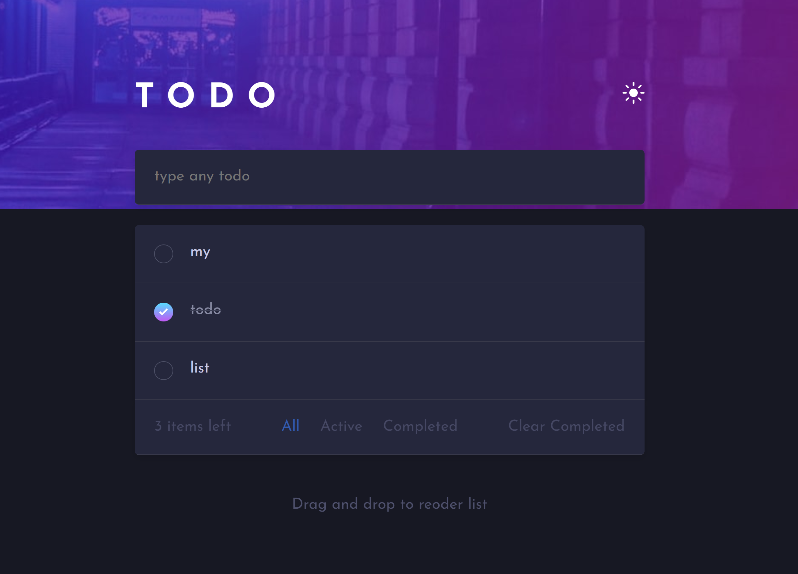
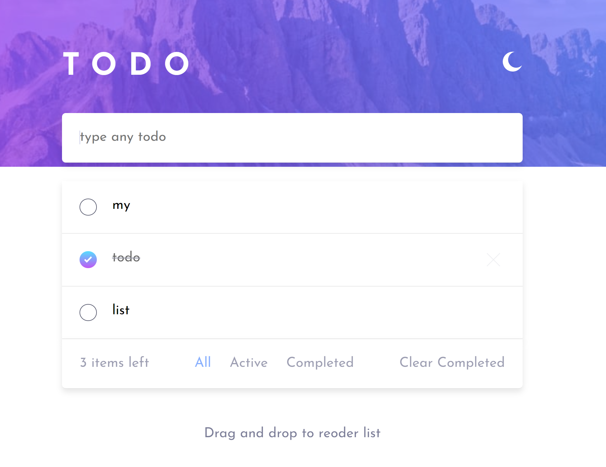

Todo app solution

This is a solution to the [Todo app challenge on Frontend Mentor](https://www.frontendmentor.io/challenges/todo-app-Su1_KokOW). Frontend Mentor challenges help you improve your coding skills by building realistic projects. 

## Table of contents

- [Overview](#overview)
  - [The challenge](#the-challenge)
  - [Screenshot](#screenshot)
  - [Links](#links)
- [My process](#my-process)
  - [Built with](#built-with)
- [Author](#author)

## Overview

### The challenge

This project is a simple Todo List application built using React that allows users to create and manage their tasks.
Users should be able to:

- View the optimal layout for the app depending on their device's screen size
- See hover states for all interactive elements on the page
- Add new todos to the list
- Mark todos as complete
- Delete todos from the list
- Filter by all/active/complete todos
- Clear all completed todos
- Toggle light and dark mode
- Save tasks on refresh
- **Bonus**: Drag and drop to reorder items on the list

### Screenshot

### Links

- Solution URL: [MySolution](http://tan-nose.surge.sh)
- Live Site URL: [Gabriel Carvalho]()

### Usage

To use the Todo List application, simply visit the deployed web page and begin adding tasks to your list. To mark a task as complete, click the checkbox next to the task. To delete an individual completed task, hover over the task and click the "X" button that appears. To clear all completed tasks at once, click the "Clear Completed" button. To drag and drop tasks, simply click and hold the task, and move it to its desired location.

## My process

### Built with

- Semantic HTML5 markup
- CSS custom properties
- Flexbox
- CSS Grid
- [React](https://reactjs.org/) - JS library
- DnD React Library

## Author

- Website - [Gabriel Carvalho](https://www.your-site.com)
